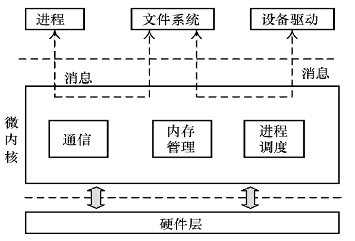
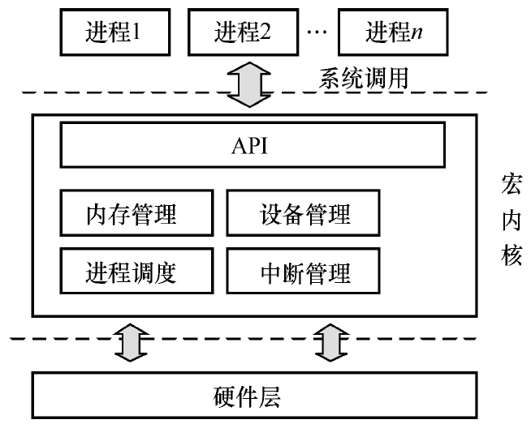

### 微内核

微内核：把操作系统分成多个独立的功能模块，每个功能模块之间的访问需要通过消息来完成



### 宏内核

宏内核：指所有的内核代码都编译成一个二进制文件，所有的内核代
码都运行在一个大内核地址空间里，内核代码可以直接访问和调用，
效率高并且性能好



### 安装 ubuntu

- vmware

  - 下载 vmware player

  * 下载 ubuntu 20.04

    https://mirror.tuna.tsinghua.edu.cn/ubuntu-releases/20.04.6/

- wsl（推荐）

  - wsl --install -d Ubuntu-20.04

- apt 新一代包管理工具，是 apt-get 和 apt-cache 等命令的高级封装

### 查看内核版本

```
rander@ubuntu:~/Desktop$ uname -v
#149~20.04.1-Ubuntu SMP Wed Apr 16 08:29:56 UTC 2025
rander@ubuntu:~/Desktop$ uname -r
5.15.0-139-generic
```

### 更新阿里源

- 下载 vim

  apt install vim

- 备份官方镜像

  ```
  sudo cp /etc/apt/sources.list /etc/apt/sources.list.back
  ```

- 更新镜像

  sudo vim /etc/apt/sources.list

  ```
  deb https://mirrors.aliyun.com/ubuntu/ focal main restricted universe multiverse
  deb-src https://mirrors.aliyun.com/ubuntu/ focal main restricted universe multiverse

  deb https://mirrors.aliyun.com/ubuntu/ focal-security main restricted universe multiverse
  deb-src https://mirrors.aliyun.com/ubuntu/ focal-security main restricted universe multiverse

  deb https://mirrors.aliyun.com/ubuntu/ focal-updates main restricted universe multiverse
  deb-src https://mirrors.aliyun.com/ubuntu/ focal-updates main restricted universe multiverse

  # deb https://mirrors.aliyun.com/ubuntu/ focal-proposed main restricted universe multiverse
  # deb-src https://mirrors.aliyun.com/ubuntu/ focal-proposed main restricted universe multiverse

  deb https://mirrors.aliyun.com/ubuntu/ focal-backports main restricted universe multiverse
  deb-src https://mirrors.aliyun.com/ubuntu/ focal-backports main restricted universe multiverse
  ```

- 更新镜像源

  ```
  sudo apt update
  ```

### 使用 QEMU 虚拟机来运行 Linux 系统

- 下载工具

  ```
  sudo apt-get install qemu-system-arm libncurses5-dev libssl-dev build-essential gcc-aarch64-linux-gnu git bison flex
  ```

- 检查 aarch64-linux-gnu-gcc 的版本

  ```
  rander@ubuntu:~/Desktop$ aarch64-linux-gnu-gcc -v
  gcc version 9.4.0 (Ubuntu 9.4.0-1ubuntu1~20.04.2)
  ```

- 检查 qemu-system-aarch64 的版本

  ```
  ander@ubuntu:~/Desktop$ qemu-system-aarch64 --version
  QEMU emulator version 4.2.1 (Debian 1:4.2-3ubuntu6.30)
  Copyright (c) 2003-2019 Fabrice Bellard and the QEMU Project developers
  ```

- 下载代码

  git clone https://github.com/figozhang/runninglinuxkernel_5.0.git

- 编译内核

  ```
  cd runninglinuxkernel_5.0/
  ./run_rlk_arm64.sh build_kernel
  ```

- 编译根文件系统

  ```
  cd runninglinuxkernel_5.0/
  sudo ./run_rlk_arm64.sh build_rootfs
  ```

- 运行

  - 用户名 root 密码 123

  - 在 console 环境下，先按 ctrl + a，释放之后再按 x 键既可退出

  ```
  cd runninglinuxkernel_5.0/
  sudo ./run_rlk_arm64.sh run
  ```

- 在主机和 QEMU 虚拟机之间共享文件

  - cp test.c ./runninglinuxkernel_5.0/kmodules/
  - test.c 则出现在 qemu 虚拟机 /mnt/ 目录中

- 在主机上交叉编译内核模块

  ```
  $ cd runninglinuxkernel_5.0/kmodules/rlk_lab/rlk_basic/chapter_1_quick_start/lab3_hello_world
  $ export ARCH=arm64
  $ export CROSS_COMPILE=aarch64-linux-gnu-
  $ make
  $ cp test.ko ./runninglinuxkernel_5.0/kmodules/
  $ insmod test.ko
  ```

- 如果修改了内核，则需要重新编译，并更新根文件系统

  ```
  ./run_rlk_arm64.sh build_kernel
  sudo ./run_rlk_arm64.sh update_rootfs
  ```

### 创建基于 Ubuntu Linux 的根文件系统

- 使用 debootstrap 工具创建基于 Ubuntu Linux 20.04 系统的根文件系统
