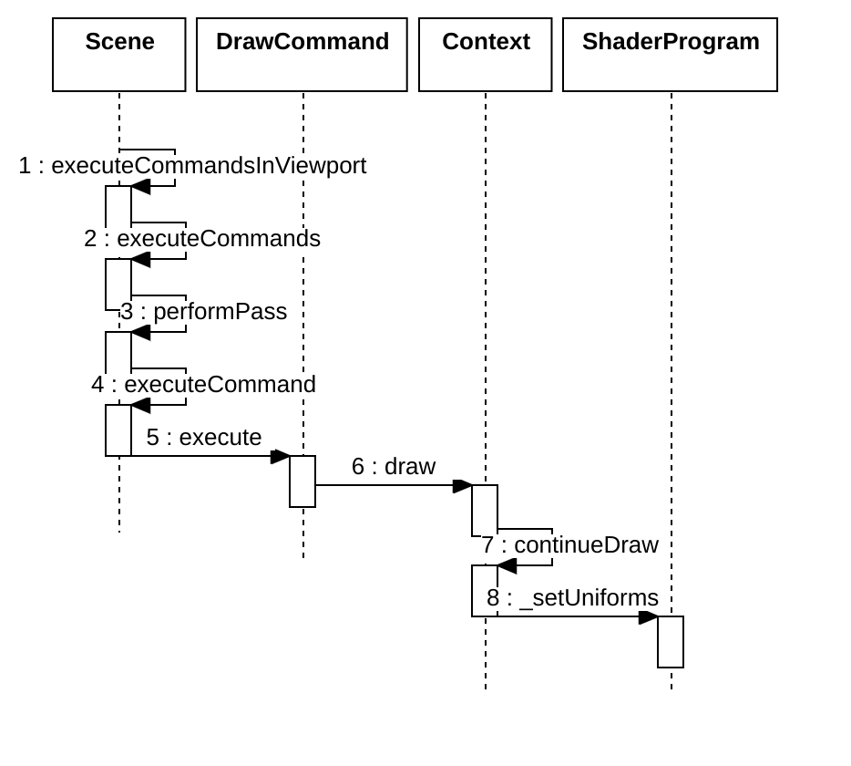

- 命名规范
  - MC，Model Coordinates（模型坐标）
  - WC，World Coordinates（世界坐标）
  - EC，Eye Coordinates（相机 / 视图坐标）
  - DC，Device Coordinates（NDC/裁剪后）

- 创建


- 设置参数



- uniformMap 来自于 drawCommand.\_uniformMap

```js
ShaderProgram.prototype._setUniforms = function (
  uniformMap,
  uniformState,
  validate,
) {
  let len;
  let i;

  if (defined(uniformMap)) {
    const manualUniforms = this._manualUniforms;
    len = manualUniforms.length;
    for (i = 0; i < len; ++i) {
      const mu = manualUniforms[i];
      mu.value = uniformMap[mu.name]();
    }
  }

  const automaticUniforms = this._automaticUniforms;
  len = automaticUniforms.length;
  for (i = 0; i < len; ++i) {
    const au = automaticUniforms[i];
    au.uniform.value = au.automaticUniform.getValue(uniformState);
  }

  const uniforms = this._uniforms;
  len = uniforms.length;
  for (i = 0; i < len; ++i) {
    uniforms[i].set();
  }
};
```

- 代码

  ```c
  in vec3 a_positionMC;
  in vec2 a_texCoord_0;

  out vec3 v_positionWC;
  out vec3 v_positionEC;
  out vec3 v_positionMC;
  out vec2 v_texCoord_0;

  uniform mat3 czm_normal;
  uniform mat4 czm_modelView;
  uniform mat4 czm_projection;

  void initializeAttributes(out ProcessedAttributes attributes)
  {
      attributes.positionMC = a_positionMC;
      attributes.texCoord_0 = a_texCoord_0;
  }
  vec4 geometryStage(inout ProcessedAttributes attributes, mat4 modelView, mat3 normal)
  {
      vec3 positionMC = attributes.positionMC;
      // 模型坐标
      v_positionMC = positionMC;
      // 相机坐标
      v_positionEC = (modelView * vec4(positionMC, 1.0)).xyz;
      // 世界坐标
      v_positionWC = (czm_model * vec4(positionMC, 1.0)).xyz;
      // 纹理坐标
      v_texCoord_0 = attributes.texCoord_0;
      // 投影坐标
      return czm_projection * vec4(v_positionEC, 1.0);
  }
  void main()
  {
      ProcessedAttributes attributes;
      initializeAttributes(attributes);

      // 视图模型矩阵
      mat4 modelView = czm_modelView;
      // 模型矩阵
      mat3 normal = czm_normal;

      vec4 positionClip = geometryStage(attributes, modelView, normal);

      gl_Position = positionClip;
  }
  ```
