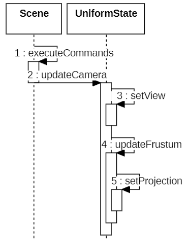
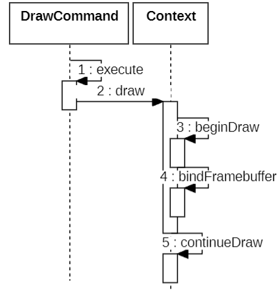

* view 视图矩阵

  
    
  ```js
  function setView(uniformState, matrix) {
    Matrix4.clone(matrix, uniformState._view);
    ......
  }
  ```
* model 模型矩阵

  * 在绘制前设置

  
  
  ```js
  function continueDraw(context, drawCommand, shaderProgram, uniformMap) {
    ......
    const primitiveType = drawCommand._primitiveType;
    let count = drawCommand._count;
    const va = drawCommand._vertexArray;
    context._us.model = drawCommand._modelMatrix ?? Matrix4.IDENTITY;
    const indexBuffer = va.indexBuffer
    offset = offset * indexBuffer.bytesPerIndex
    context._gl.drawElements(
        primitiveType,
        count,
        indexBuffer.indexDatatype,
        offset,
      );
  }
  ```
  
* modelView 视图模型矩阵
  * cleanModelView 根据 _view 和 _model 计算 _modelView
  ```js
  Object.defineProperties(UniformState.prototype, {
    modelView: {
      get: function () {
        cleanModelView(this);
        return this._modelView;
      },
    }
  }

  function cleanModelView(uniformState) {
    if (uniformState._modelViewDirty) {
      uniformState._modelViewDirty = false;

      Matrix4.multiplyTransformation(
        uniformState._view,
        uniformState._model,
        uniformState._modelView,
      );
    }
  }
  ```
  
* projection 投影矩阵

  ```js
  function setProjection(uniformState, matrix) {
    Matrix4.clone(matrix, uniformState._projection);
    ......
  }
  ```