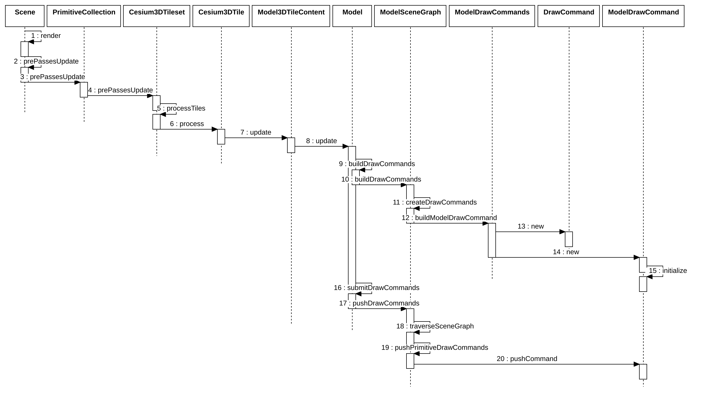

### DrawCommand



```js
function DrawCommand(options) {
  options = options ?? Frozen.EMPTY_OBJECT;

  this._boundingVolume = options.boundingVolume;
  this._orientedBoundingBox = options.orientedBoundingBox;
  this._modelMatrix = options.modelMatrix;
  this._primitiveType = options.primitiveType ?? PrimitiveType.TRIANGLES;
  this._vertexArray = options.vertexArray;
  this._count = options.count;
  this._offset = options.offset ?? 0;
  this._instanceCount = options.instanceCount ?? 0;
  this._shaderProgram = options.shaderProgram;
  this._uniformMap = options.uniformMap;
  this._renderState = options.renderState;
  this._framebuffer = options.framebuffer;
  this._pass = options.pass;
  this._owner = options.owner;
  this._debugOverlappingFrustums = 0;
  this._pickId = options.pickId;
  this._pickMetadataAllowed = options.pickMetadataAllowed === true;
  this._pickedMetadataInfo = undefined;

  // Set initial flags.
  this._flags = 0;
  this.cull = options.cull ?? true;
  this.occlude = options.occlude ?? true;
  this.executeInClosestFrustum = options.executeInClosestFrustum ?? false;
  this.debugShowBoundingVolume = options.debugShowBoundingVolume ?? false;
  this.castShadows = options.castShadows ?? false;
  this.receiveShadows = options.receiveShadows ?? false;
  this.pickOnly = options.pickOnly ?? false;
  this.depthForTranslucentClassification =
    options.depthForTranslucentClassification ?? false;

  this.dirty = true;
  this.lastDirtyTime = 0;

  /**
   * @private
   */
  this.derivedCommands = {};
}
```
