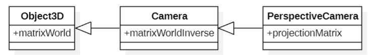

### Object3D

* frustumCulled：是否进行视锥体裁剪
* pivot: 表示中心点，默认为空，影响缩放和旋转
* position: 保存平移变换
* scale: 保存缩放变换
* quaternion: 四元数，保存旋转变换
* matrix: 表示自身的缩放、旋转、平移变换，由 position、scale、quaternion 生成

* matrixWorld: 世界矩阵
  * $matrixWorld = matrixWorld_{parent} * matrix$

* lookat: 生成旋转变换，并保存到 quaternion

* updateMatrixWorld: 生成自身以及子 Object3D 的 matrixWorld

* updateMatrix: 由 position、scale、quaternion 生成 matrix

  * this.matrix.compose( this.position, this.quaternion, this.scale );
  
### Camera

* matrixWorldInverse: 表示视图变换

### PerspectiveCamera



* projectionMatrix: 表示投影变换

### Vector3

- length: 向量长度

```js
length() {
  return Math.sqrt( this.x * this.x + this.y * this.y + this.z * this.z );
}
```

- lengthSq: 向量长度的平方

```js
length() {
  return this.x * this.x + this.y * this.y + this.z * this.z;
}
```

- normalize: 使自身变成单位向量

- crossVectors: 将向量 a 和 b 叉乘的结果保存到自身

```js
crossVectors( a, b ) {
  const ax = a.x, ay = a.y, az = a.z;
	const bx = b.x, by = b.y, bz = b.z;

  this.x = ay * bz - az * by;
  this.y = az * bx - ax * bz;
  this.z = ax * by - ay * bx;

  return this;
}
```

### Box3

- setFromPoints：计算轴对齐包围盒（包含所有点最小长方体）

```js
const box = new THREE.Box3().setFromPoints(points);
```

### Matrix4

- 列优先

  ```
  const m = new THREE.Matrix4();
  m.set(11, 12, 13, 14,
        21, 22, 23, 24,
        31, 32, 33, 34,
        41, 42, 43, 44 );
  ```

  - 实际存储为

  ```
  m.elements = [ 11, 21, 31, 41,
                12, 22, 32, 42,
                13, 23, 33, 43,
                14, 24, 34, 44 ];
  ```

* lookat：求相机坐标系下的基向量矩阵

  ```js
  lookAt( eye, target, up ) {
  	const te = this.elements;
  	_z.subVectors( eye, target );
  	_z.normalize();
  	_x.crossVectors( up, _z );
  	_x.normalize();
  	_y.crossVectors( _z, _x );
  	te[ 0 ] = _x.x; te[ 4 ] = _y.x; te[ 8 ] = _z.x;
  	te[ 1 ] = _x.y; te[ 5 ] = _y.y; te[ 9 ] = _z.y;
  	te[ 2 ] = _x.z; te[ 6 ] = _y.z; te[ 10 ] = _z.z;
  	return this;
  }
  ```

- invert 求逆矩阵

* transpose 求转置矩阵

* compose( position, quaternion, scale ) 根据平移、旋转（四元数）和缩放生成一个矩阵