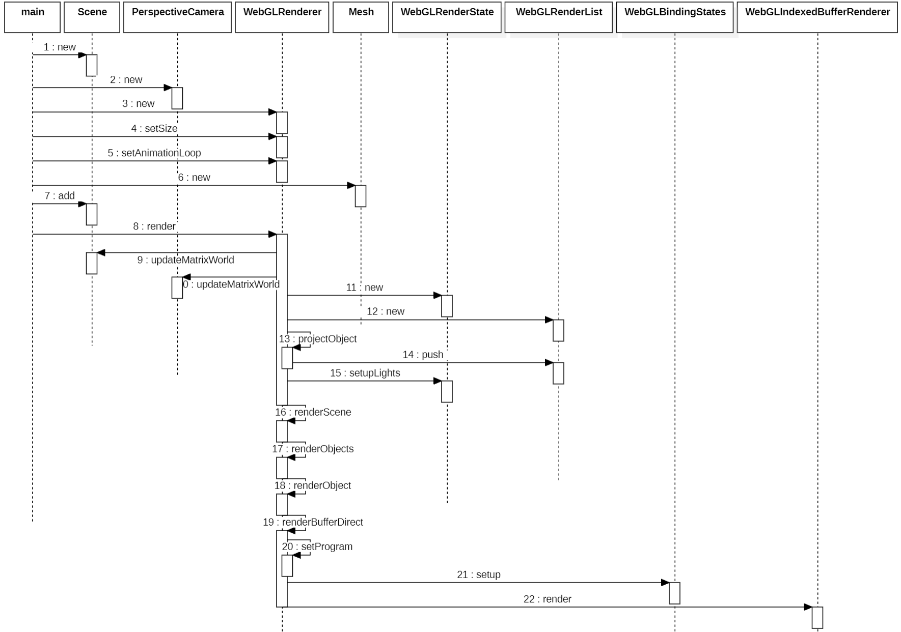

### 流程图



### WebGLRenderer.render

* scene.updateMatrixWorld 生成物体的模型矩阵
* camera.updateMatrixWorld 生成相机的视图矩阵
* _projScreenMatrix 投影矩阵 * 视图矩阵
* _frustum 计算视锥体
* projectObject 进行裁剪，然后放入 currentRenderList
* currentRenderState.setupLights 设置光照

```js
function render( scene, camera ) {
  scene.updateMatrixWorld();
  camera.updateMatrixWorld();

  currentRenderState = renderStates.get( scene, renderStateStack.length );
  currentRenderState.init( camera );
  renderStateStack.push( currentRenderState );

  _projScreenMatrix.multiplyMatrices( camera.projectionMatrix, camera.matrixWorldInverse );
  _frustum.setFromProjectionMatrix( _projScreenMatrix, WebGLCoordinateSystem, camera.reversedDepth );

  currentRenderList = renderLists.get( scene, renderListStack.length );
  currentRenderList.init();
  renderListStack.push( currentRenderList );
  
  projectObject( scene, camera, 0, _this.sortObjects );
  
  currentRenderList.finish();
  
  currentRenderState.setupLights();
  renderScene( currentRenderList, scene, camera );
  ......
};
```

### WebGLRenderer.renderScene

* object.modelViewMatrix 顶点变换矩阵
* object.normalMatrix 法向量变换矩阵

```js
function renderScene( currentRenderList, scene, camera, viewport ) {
  const { opaque: opaqueObjects} = currentRenderList;
  currentRenderState.setupLightsView( camera );
  renderObjects( opaqueObjects, scene, camera );
  state.setPolygonOffset( false );
}
function renderObject( object, scene, camera, geometry, material, group ) {
  object.modelViewMatrix.multiplyMatrices( camera.matrixWorldInverse, object.matrixWorld );
  object.normalMatrix.getNormalMatrix( object.modelViewMatrix );
  _this.renderBufferDirect( camera, scene, geometry, material, object, group );
}
this.renderBufferDirect = function ( camera, scene, geometry, material, object, group ) {
  const program = setProgram( camera, scene, geometry, material, object );
  bindingStates.setup( object, material, program, geometry, index );
  let index = geometry.index;
  let attribute = attributes.get( index );
  let renderer = indexedBufferRenderer;
  renderer.setIndex( attribute );
  renderer.setMode( _gl.TRIANGLES );
  renderer.render( drawStart, drawCount );
};
function setProgram( camera, scene, geometry, material, object ) {
  p_uniforms.setValue( _gl, 'projectionMatrix', camera.projectionMatrix );
  p_uniforms.setValue( _gl, 'modelViewMatrix', object.modelViewMatrix );
  return program;
}
```

### WebGLIndexedBufferRenderer.render

```js
function render( start, count ) {
  gl.drawElements( mode, count, type, start * bytesPerElement );
}
```

### 顶点着色器

```glsl
#version 300 es

#define attribute in
#define varying out
#define texture2D texture

precision highp float;
precision highp int;

#define PI 3.141592653589793
#define EPSILON 1e-6

uniform mat4 modelMatrix;
uniform mat4 modelViewMatrix;
uniform mat4 projectionMatrix;
uniform mat4 viewMatrix;
uniform mat3 normalMatrix;
uniform vec3 cameraPosition;
uniform bool isOrthographic;

in vec3 position;
in vec3 normal;
in vec2 uv;

out vec2 vUv;

void main() {
    vUv = uv;

    vec3 transformed = position;
    vec4 mvPosition = modelViewMatrix * vec4(transformed, 1.0);
    gl_Position = projectionMatrix * mvPosition;
}
```