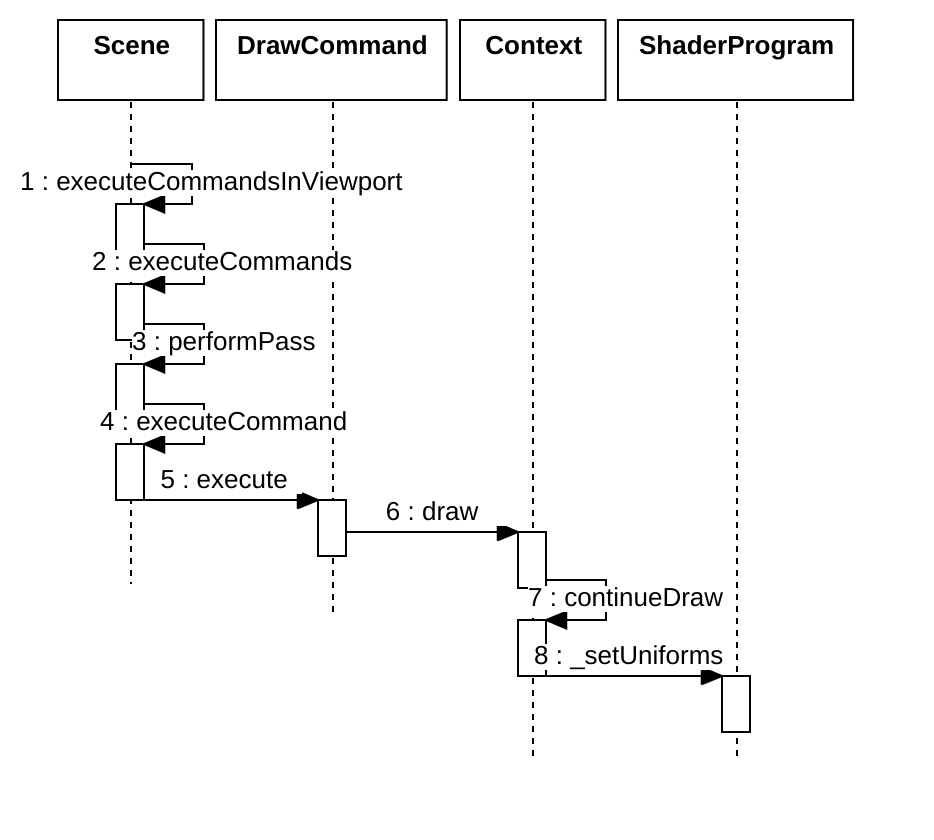

### 视图矩阵



```js
Object.defineProperties(Camera.prototype, {
  viewMatrix: {
    get: function () {
      updateMembers(this);
      return this._viewMatrix;
    },
  }
}
UniformState.prototype.updateCamera = function (camera) {
  setView(this, camera.viewMatrix);
  setInverseView(this, camera.inverseViewMatrix);
  setCamera(this, camera);

  this._entireFrustum.x = camera.frustum.near;
  this._entireFrustum.y = camera.frustum.far;
  this.updateFrustum(camera.frustum);

  this._orthographicIn3D =
    this._mode !== SceneMode.SCENE2D &&
    camera.frustum instanceof OrthographicFrustum;
};
function setView(uniformState, matrix) {
  Matrix4.clone(matrix, uniformState._view);
  Matrix4.getMatrix3(matrix, uniformState._viewRotation);

  uniformState._view3DDirty = true;
  uniformState._inverseView3DDirty = true;
  uniformState._modelViewDirty = true;
  uniformState._modelView3DDirty = true;
  uniformState._modelViewRelativeToEyeDirty = true;
  uniformState._inverseModelViewDirty = true;
  uniformState._inverseModelView3DDirty = true;
  uniformState._viewProjectionDirty = true;
  uniformState._inverseViewProjectionDirty = true;
  uniformState._modelViewProjectionDirty = true;
  uniformState._modelViewProjectionRelativeToEyeDirty = true;
  uniformState._modelViewInfiniteProjectionDirty = true;
  uniformState._normalDirty = true;
  uniformState._inverseNormalDirty = true;
  uniformState._normal3DDirty = true;
  uniformState._inverseNormal3DDirty = true;
}
```

### 计算

```js
function updateMembers(camera) {
  const mode = camera._mode;

  let heightChanged = false;
  let height = 0.0;
  if (mode === SceneMode.SCENE2D) {
    height = camera.frustum.right - camera.frustum.left;
    heightChanged = height !== camera._positionCartographic.height;
  }

  let position = camera._position;
  const positionChanged =
    !Cartesian3.equals(position, camera.position) || heightChanged;
  if (positionChanged) {
    position = Cartesian3.clone(camera.position, camera._position);
  }

  let direction = camera._direction;
  const directionChanged = !Cartesian3.equals(direction, camera.direction);
  if (directionChanged) {
    Cartesian3.normalize(camera.direction, camera.direction);
    direction = Cartesian3.clone(camera.direction, camera._direction);
  }

  let up = camera._up;
  const upChanged = !Cartesian3.equals(up, camera.up);
  if (upChanged) {
    Cartesian3.normalize(camera.up, camera.up);
    up = Cartesian3.clone(camera.up, camera._up);
  }

  let right = camera._right;
  const rightChanged = !Cartesian3.equals(right, camera.right);
  if (rightChanged) {
    Cartesian3.normalize(camera.right, camera.right);
    right = Cartesian3.clone(camera.right, camera._right);
  }

  const transformChanged = camera._transformChanged || camera._modeChanged;
  camera._transformChanged = false;

  if (transformChanged) {
    Matrix4.inverseTransformation(camera._transform, camera._invTransform);

    if (
      camera._mode === SceneMode.COLUMBUS_VIEW ||
      camera._mode === SceneMode.SCENE2D
    ) {
      if (Matrix4.equals(Matrix4.IDENTITY, camera._transform)) {
        Matrix4.clone(Camera.TRANSFORM_2D, camera._actualTransform);
      } else if (camera._mode === SceneMode.COLUMBUS_VIEW) {
        convertTransformForColumbusView(camera);
      } else {
        convertTransformFor2D(camera);
      }
    } else {
      Matrix4.clone(camera._transform, camera._actualTransform);
    }

    Matrix4.inverseTransformation(
      camera._actualTransform,
      camera._actualInvTransform,
    );

    camera._modeChanged = false;
  }

  const transform = camera._actualTransform;

  if (positionChanged || transformChanged) {
    camera._positionWC = Matrix4.multiplyByPoint(
      transform,
      position,
      camera._positionWC,
    );

    // Compute the Cartographic position of the camera.
    if (mode === SceneMode.SCENE3D || mode === SceneMode.MORPHING) {
      camera._positionCartographic =
        camera._projection.ellipsoid.cartesianToCartographic(
          camera._positionWC,
          camera._positionCartographic,
        );
    } else {
      // The camera position is expressed in the 2D coordinate system where the Y axis is to the East,
      // the Z axis is to the North, and the X axis is out of the map.  Express them instead in the ENU axes where
      // X is to the East, Y is to the North, and Z is out of the local horizontal plane.
      const positionENU = scratchCartesian;
      positionENU.x = camera._positionWC.y;
      positionENU.y = camera._positionWC.z;
      positionENU.z = camera._positionWC.x;

      // In 2D, the camera height is always 12.7 million meters.
      // The apparent height is equal to half the frustum width.
      if (mode === SceneMode.SCENE2D) {
        positionENU.z = height;
      }

      camera._projection.unproject(positionENU, camera._positionCartographic);
    }
  }

  if (directionChanged || upChanged || rightChanged) {
    const det = Cartesian3.dot(
      direction,
      Cartesian3.cross(up, right, scratchCartesian),
    );
    if (Math.abs(1.0 - det) > CesiumMath.EPSILON2) {
      //orthonormalize axes
      const invUpMag = 1.0 / Cartesian3.magnitudeSquared(up);
      const scalar = Cartesian3.dot(up, direction) * invUpMag;
      const w0 = Cartesian3.multiplyByScalar(
        direction,
        scalar,
        scratchCartesian,
      );
      up = Cartesian3.normalize(
        Cartesian3.subtract(up, w0, camera._up),
        camera._up,
      );
      Cartesian3.clone(up, camera.up);

      right = Cartesian3.cross(direction, up, camera._right);
      Cartesian3.clone(right, camera.right);
    }
  }

  if (directionChanged || transformChanged) {
    camera._directionWC = Matrix4.multiplyByPointAsVector(
      transform,
      direction,
      camera._directionWC,
    );
    Cartesian3.normalize(camera._directionWC, camera._directionWC);
  }

  if (upChanged || transformChanged) {
    camera._upWC = Matrix4.multiplyByPointAsVector(transform, up, camera._upWC);
    Cartesian3.normalize(camera._upWC, camera._upWC);
  }

  if (rightChanged || transformChanged) {
    camera._rightWC = Matrix4.multiplyByPointAsVector(
      transform,
      right,
      camera._rightWC,
    );
    Cartesian3.normalize(camera._rightWC, camera._rightWC);
  }

  if (
    positionChanged ||
    directionChanged ||
    upChanged ||
    rightChanged ||
    transformChanged
  ) {
    updateViewMatrix(camera);
  }
}
function updateViewMatrix(camera) {
  Matrix4.computeView(
    camera._position,
    camera._direction,
    camera._up,
    camera._right,
    camera._viewMatrix,
  );
  Matrix4.multiply(
    camera._viewMatrix,
    camera._actualInvTransform,
    camera._viewMatrix,
  );
  Matrix4.inverseTransformation(camera._viewMatrix, camera._invViewMatrix);
}
```
