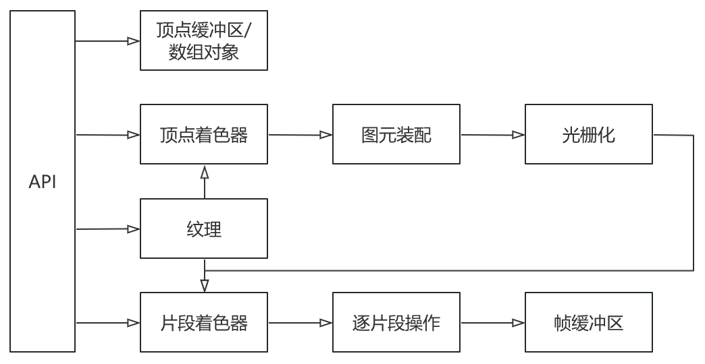

### 渲染管线



### 顶点着色器

- 将顶点坐标传给 gl_Position

### 图元装配

- 图元：组成模型的基本元素称为图元，主要有点、线、三角形

- 坐标转换
  - {x,y,z,w} 转化为 {x/w,y/w,z/w,1}

- 裁剪，剔除在{-1.0~1.0,-1.0~1.0,-1.0~1.0}外的图元

### 光栅化

- 剔除(光栅化之前)
  - 三角形通常既可以顺时针生成，也可以逆时针生成

  - frontFace 指定正面三角形的方向

  - cullFace 指定剔除哪一面三角形，正面还是反面

- 由图元经插值得到片段的过程称为光栅化
  - 片段：图元经插值，使其内部与屏幕中的像素点一一对应，映射后的像素点的集合称为片段


### 片段着色器

- 输入为片段中每个像素点的数据(包括坐标和颜色)，输出该像素点的颜色

- 片段着色器可以通过 discard 进行 alpha 测试

  ```js
  if (color.a < 0.25) {
    discard;
  }
  ```

### 逐片段操作


### 参考

https://developer.mozilla.org/zh-CN/docs/Web/API/WebGLRenderingContext
