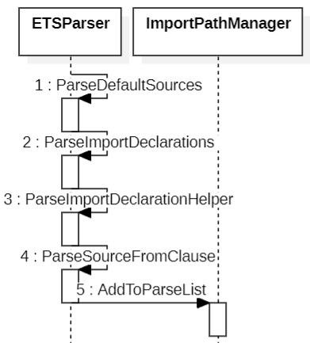

- 总流程

  

* ParseDefaultSources

  ```c++
  ArenaVector<ir::ETSImportDeclaration *> ETSParser::ParseDefaultSources(std::string_view srcFile,
                                                                       std::string_view importSrc)
  {
      auto isp = InnerSourceParser(this);
      SourceFile source(srcFile, importSrc);

      auto lexer = InitLexer(source);

      Lexer()->NextToken();

      GetContext().Status() |= ParserStatus::IN_DEFAULT_IMPORTS;
      auto statements = ParseImportDeclarations();
      GetContext().Status() &= ~ParserStatus::IN_DEFAULT_IMPORTS;

      AddExternalSource(ParseSources());
      return statements;
  }
  ```

* ParseImportDeclarations

  - 解析 import \* from "std/core"

  ```c++
  ArenaVector<ir::ETSImportDeclaration *> ETSParser::ParseImportDeclarations()
  {
    std::vector<std::string> userPaths;
    ArenaVector<ir::ETSImportDeclaration *> statements(Allocator()->Adapter());

    while (Lexer()->GetToken().Type() == lexer::TokenType::KEYW_IMPORT) {
        auto startLoc = Lexer()->GetToken().Start();
        Lexer()->NextToken();  // eat import

        ir::ImportKinds importKind =
            Lexer()->TryEatTokenKeyword(lexer::TokenType::KEYW_TYPE) ? ir::ImportKinds::TYPE : ir::ImportKinds::VALUE;

        ArenaVector<ir::AstNode *> specifiers(Allocator()->Adapter());
        ArenaVector<ir::AstNode *> defaultSpecifiers(Allocator()->Adapter());

        if (Lexer()->GetToken().Type() == lexer::TokenType::PUNCTUATOR_MULTIPLY) {
            if (importKind == ir::ImportKinds::TYPE) {
                LogSyntaxError("Type import requires selective binding to define the required imported elements.");
            }
            ParseNameSpaceSpecifier(&specifiers);
        } else if (Lexer()->GetToken().Type() == lexer::TokenType::PUNCTUATOR_LEFT_BRACE) {
            auto specs = ParseNamedSpecifiers();
            specifiers = util::Helpers::ConvertVector<ir::AstNode>(specs.first);
            defaultSpecifiers = util::Helpers::ConvertVector<ir::AstNode>(specs.second);
        } else {
            ParseImportDefaultSpecifier(&specifiers);
        }
        auto pos = Lexer()->Save();
        if (!specifiers.empty()) {
            auto *const importDecl = ParseImportDeclarationHelper(startLoc, specifiers, importKind);
            if (!importDecl->IsBrokenStatement()) {
                statements.push_back(importDecl->AsETSImportDeclaration());
            }
        }

        if (!defaultSpecifiers.empty()) {
            Lexer()->Rewind(pos);
            auto *const importDeclDefault = ParseImportDeclarationHelper(startLoc, defaultSpecifiers, importKind);
            if (!importDeclDefault->IsBrokenStatement()) {
                util::Helpers::CheckDefaultImport(statements);
                statements.push_back(importDeclDefault->AsETSImportDeclaration());
            }
        }
    }

    std::sort(statements.begin(), statements.end(), [](const auto *s1, const auto *s2) -> bool {
        return s1->Specifiers()[0]->IsImportNamespaceSpecifier() && !s2->Specifiers()[0]->IsImportNamespaceSpecifier();
    });
    return statements;
  }
  ```

- ParseSourceFromClause

  ```c++
  ir::ImportSource *ETSParser::ParseSourceFromClause(bool requireFrom)
  {
      if (Lexer()->GetToken().KeywordType() != lexer::TokenType::KEYW_FROM && requireFrom) {
          LogExpectedToken(lexer::TokenType::KEYW_FROM);
      }
      Lexer()->NextToken();  // eat `from`

      if (Lexer()->GetToken().Type() != lexer::TokenType::LITERAL_STRING) {
          LogExpectedToken(lexer::TokenType::LITERAL_STRING);
          return nullptr;  // Error processing.
      }

      ASSERT(Lexer()->GetToken().Type() == lexer::TokenType::LITERAL_STRING);
      auto importPath = Lexer()->GetToken().Ident();
      auto resolvedImportPath =
          importPathManager_->ResolvePath(GetProgram()->AbsoluteName(), importPath, Lexer()->GetToken().Start());
      if (globalProgram_->AbsoluteName() != resolvedImportPath) {
          importPathManager_->AddToParseList(resolvedImportPath,
                                          (GetContext().Status() & ParserStatus::IN_DEFAULT_IMPORTS) != 0U
                                              ? util::ImportFlags::DEFAULT_IMPORT
                                              : util::ImportFlags::NONE,
                                          Lexer()->GetToken().Start());
      }

      auto *resolvedSource = AllocNode<ir::StringLiteral>(resolvedImportPath);
      auto importData = importPathManager_->GetImportData(resolvedImportPath, Extension());
      auto *source = AllocNode<ir::StringLiteral>(importPath);
      source->SetRange(Lexer()->GetToken().Loc());

      Lexer()->NextToken();

      return Allocator()->New<ir::ImportSource>(source, resolvedSource, importData.lang, importData.hasDecl);
  }
  ```

* AddToParseList

  ```c++
  void ImportPathManager::AddToParseList(const StringView &resolvedPath, const ImportFlags importFlags,
                                       const lexer::SourcePosition &srcPos)
  {
      const bool isDefaultImport = (importFlags & ImportFlags::DEFAULT_IMPORT) != 0;
      const bool isImplicitPackageImport = (importFlags & ImportFlags::IMPLICIT_PACKAGE_IMPORT) != 0;
      const auto parseInfo = ParseInfo {resolvedPath, false, isImplicitPackageImport};

      if (ark::os::file::File::IsDirectory(resolvedPath.Mutf8())) {
  #ifdef USE_UNIX_SYSCALL
          UnixWalkThroughDirectoryAndAddToParseList(resolvedPath, importFlags, srcPos);
  #else
          for (auto const &entry : fs::directory_iterator(resolvedPath.Mutf8())) {
              if (!fs::is_regular_file(entry) || !IsCompatibleExtension(entry.path().extension().string())) {
                  continue;
              }

              AddToParseList(UString(entry.path().string(), allocator_).View(), importFlags, srcPos);
          }
          return;
  #endif
      }

      // Check if file has been already added to parse list
      if (const auto &found =
              std::find_if(parseList_.begin(), parseList_.end(),
                          [&resolvedPath](const ParseInfo &info) { return (info.sourcePath == resolvedPath); });
          found != parseList_.end()) {
          // The 'parseList_' can contain at most 1 record with the same source file path (else it'll break things).
          //
          // If a file is added as implicit package imported before, then we may add it again without the implicit import
          // directive (and remove the other one), to handle when an implicitly package imported file explicitly imports
          // it. Re-parsing it is necessary, because if the implicitly package imported file contains a syntax error, then
          // it'll be ignored, but we must not ignore it if an explicitly imported file contains a parse error. Also this
          // addition can happen during parsing the files in the parse list, so re-addition is necessary in order to
          // surely re-parse it.
          //
          // If a file was already not implicitly package imported, then it's just a duplicate, return
          if (!found->isImplicitPackageImported) {
              return;
          }

          parseList_.erase(found);
      }

      if (const auto &dynamicPaths = arktsConfig_->DynamicPaths();
          dynamicPaths.find(resolvedPath.Mutf8()) != dynamicPaths.cend()) {
          parseList_.emplace(parseList_.begin(), parseInfo);
          return;
      }

      if (!ark::os::file::File::IsRegularFile(resolvedPath.Mutf8())) {
          diagnosticEngine_.LogFatalError(
              program_, {"Not an available source path: ", util::StringView(resolvedPath.Mutf8())}, srcPos);
          return;
      }

      // 'Object.sts' must be the first in the parse list
      // NOTE (mmartin): still must be the first?
      const std::size_t position = resolvedPath.Mutf8().find_last_of("/\\");
      if (isDefaultImport && resolvedPath.Substr(position + 1, resolvedPath.Length()).Is("Object.sts")) {
          parseList_.emplace(parseList_.begin(), parseInfo);
      } else {
          parseList_.emplace_back(parseInfo);
      }
  }
  ```
