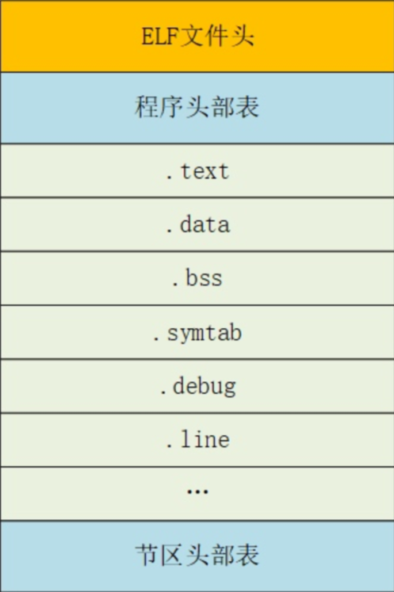

### ELF 工具链与实用命令

- 查看 ELF 文件信息

```bash
readelf -h file    # 查看ELF头部
readelf -l file    # 查看程序头表
readelf -S file    # 查看节头表
readelf -s file    # 查看符号表
readelf -d file    # 查看动态段
```

- 反汇编和查看目标文件信息

```bash
objdump -d file    # 反汇编代码段
objdump -x file    # 显示所有头信息
objdump -r file    # 显示重定位条目
```

- 查看符号表

```bash
nm file            # 显示符号表
nm -D file         # 显示动态符号表(共享库)
```

- 杂

```bash
file elf_file      # 快速识别文件类型
ldd elf_file       # 查看动态库依赖
strip elf_file     # 去除符号表和调试信息
```
