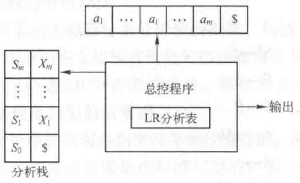
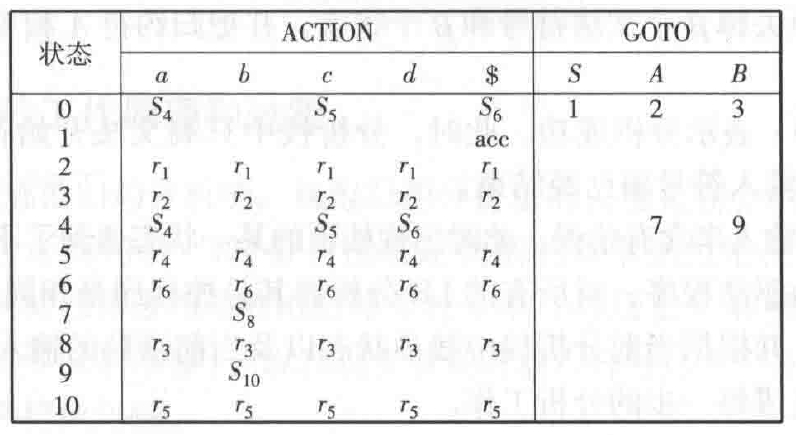
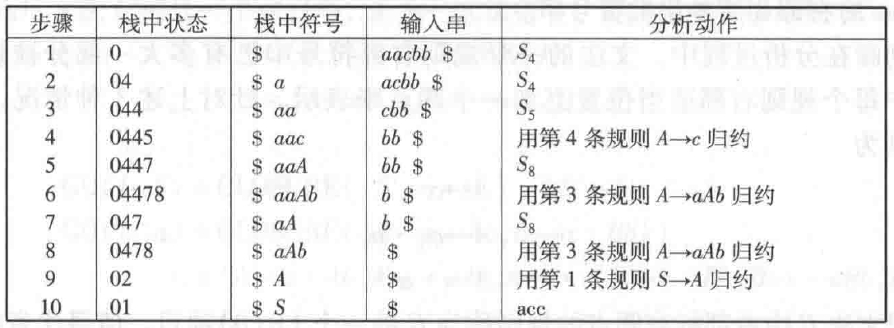

## LR

- $L$ 表示从左到右扫描输入符号串，$R$ 表示构造最右推导的逆过程，即最左归约
  
- $LR$ 分析栈包含状态栈和符号栈
  - 状态栈，初始化为起始状态
  - 符号栈，初始化为空
- $LR$ 分析表包含 $Action$ 表 和 $Goto$ 表
  - $Goto[S_i, A]$ 规定，当归约时，对于文法规则 $A→α$，应转移到的哪一个状态
  - $Action[S_i, a]$ 规定，对于输入符号 $a$ 应执行的动作
    - 移进：把状态 $S_j=Goto[S_i, a]$ 和 $a$ 移入分析栈
    - 归约：当栈顶符号串 $α$ 形成句柄，则根据文法规则 $A→α$（其中 $α$ 长度为 $n$），从分析栈栈顶去掉 $n$ 个符号和状态，并把归约符 $A$ 和 $Goto[S_{i-n}, A]=S_j$ 移入分析栈。
    - 接受（$acc$）：表示分析成功。此时符号栈为开始符号，且输入符号串已经结束（用$\$$表示）。
    - 报错：表述输入串含有错误，即，栈顶的某一状态遇到了不该遇到的输入符号
- 示例，处理输入串 $aacbb\ \$$
  - 分析表
    
  - 分析过程
    

## LR(0)

## SLR(1)

## LR(1)
